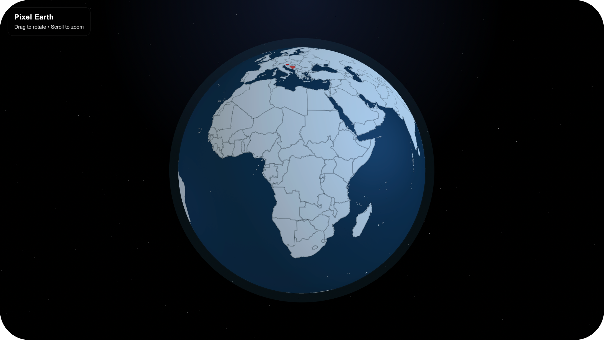

# Pixel Earth

A lightweight interactive 3D Earth visualization built with Three.js, featuring country-level rendering using GeoJSON data and dynamic highlighting.

<p align="center">
  
</p>

## Overview

Pixel Earth renders a stylized globe with countries drawn procedurally onto a texture using canvas. It supports smooth camera controls, atmospheric effects, and configurable country highlighting.

The project is designed to be simple, performant, and easily extendable for more advanced features like interaction, selection, and data visualization.

## Features

- 3D Earth rendered with Three.js
- Country borders generated from GeoJSON
- Dynamic country highlighting with custom colors
- Smooth orbit controls with auto-rotation
- Atmospheric glow and starfield background
- High-resolution canvas texture (4096x2048)
- Lightweight and framework-free setup

## Tech Stack

| Layer        | Technology        |
|--------------|------------------|
| Rendering    | Three.js         |
| Data Source  | GeoJSON          |
| Graphics     | HTML Canvas API  |
| Controls     | OrbitControls    |

## Project Structure

```

.
├── index.html
├── style.css
├── app.js
└── countries.geo.json

```

## Usage

You can dynamically change highlighted countries from the browser console:

```js
setHighlightedCountries({
'Bosnia and Herzegovina': '#ff3b30',
'Slovenia': '#ff3b30,
});
````

## Notes

* Country matching is normalized to handle different naming formats.
* Texture is regenerated when highlights are updated.
* Designed for extension (click interaction, zoom-to-country, etc.).

## Future Improvements

* Click detection (raycasting + country lookup)
* Zoom-to-country functionality
* Hover interaction with tooltip
* Performance optimization with spatial indexing
* GPU-based rendering for large datasets